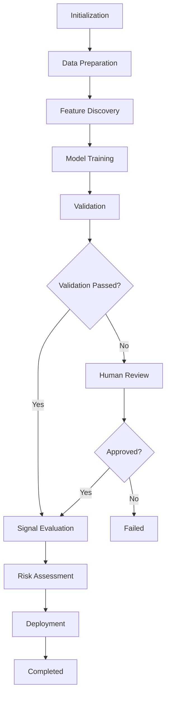

# Quantitative Trading Bot Multi-Agent Orchestration System

A production-ready LangGraph-based multi-agent system for coordinating specialized agents in quantitative trading bot development. This system implements a hierarchical supervisor pattern with advanced state management, checkpointing, and parallel execution capabilities.

## Table of Contents

- [Overview](#overview)
- [Architecture](#architecture)
- [Features](#features)
- [Installation](#installation)
- [Quick Start](#quick-start)
- [Agent Specifications](#agent-specifications)
- [Workflow Stages](#workflow-stages)
- [Configuration](#configuration)
- [Usage Examples](#usage-examples)
- [Testing](#testing)
- [Deployment](#deployment)
- [API Reference](#api-reference)

## Overview

This system orchestrates six specialized agents to automate the complete workflow of trading bot development:

1. **Data Engineer** - Historical data preparation and Forexsb integration
2. **SMC Analyst** - Smart Money Concepts, Wyckoff, and ICT analysis
3. **ML Engineer** - Feature engineering and LightGBM model training
4. **Risk Manager** - Position sizing and portfolio risk assessment
5. **Validation Agent** - Walk-forward testing and overfitting detection
6. **Signal Evaluator** - Signal generation and quality filtering

A **Supervisor Agent** coordinates these specialists, routing tasks and managing the workflow.

## Architecture

### Multi-Agent Orchestration Pattern

The system uses a **Hierarchical Supervisor Pattern**:

```
                    ┌─────────────────┐
                    │   Supervisor    │
                    │     Agent       │
                    └────────┬────────┘
                             │
        ┌────────────────────┼────────────────────┐
        │                    │                    │
   ┌────▼────┐         ┌────▼────┐         ┌────▼────┐
   │  Data   │         │   SMC   │         │   ML    │
   │Engineer │         │ Analyst │         │Engineer │
   └─────────┘         └─────────┘         └─────────┘
        │                    │                    │
        └────────────────────┼────────────────────┘
                             │
        ┌────────────────────┼────────────────────┐
        │                    │                    │
   ┌────▼────┐         ┌────▼────┐         ┌────▼────┐
   │  Risk   │         │Validation│        │ Signal  │
   │ Manager │         │  Agent   │        │Evaluator│
   └─────────┘         └─────────┘         └─────────┘
```

### State Flow



### Key Design Patterns

- **State Management**: Strongly-typed Pydantic models with proper validation
- **Checkpointing**: SQLite-based state persistence for long-running workflows
- **Parallel Execution**: Concurrent agent execution where dependencies allow
- **Human-in-the-Loop**: Approval gates at critical decision points
- **Error Recovery**: Comprehensive error handling with graceful degradation

## Features

### Core Capabilities

- **Multi-Agent Coordination**: Hierarchical supervisor manages specialist agents
- **State Persistence**: Checkpoint and resume long-running workflows
- **Parallel Processing**: Execute independent agents concurrently
- **Human Approval Gates**: Pause for human review at critical stages
- **Streaming Updates**: Real-time progress monitoring
- **Comprehensive Logging**: Structured logging with workflow context

### Trading-Specific Features

- **SMC Analysis**: Order blocks, FVG, BOS/CHOCH, liquidity analysis
- **Wyckoff Method**: Accumulation/distribution phase detection
- **ICT Concepts**: OTE, Kill Zones, institutional order flow
- **LightGBM Training**: Optimized gradient boosting for trading signals
- **Walk-Forward Validation**: Robust out-of-sample testing
- **Risk Management**: Kelly criterion, VaR, position sizing
- **Signal Filtering**: Quality-based signal selection

## Installation

### Prerequisites

- Python 3.11 or higher
- Poetry (recommended) or pip
- API key for OpenAI or Anthropic

### Using Poetry (Recommended)

```bash
cd "Agents Trading"
poetry install
```

### Using pip

```bash
cd "Agents Trading"
pip install -e .
```

### Environment Setup

1. Copy the example environment file:

```bash
cp .env.example .env
```

2. Edit `.env` and configure your API keys:

```env
# Choose your LLM provider
LLM_PROVIDER=anthropic  # or openai
ANTHROPIC_API_KEY=your_anthropic_api_key_here
# or
OPENAI_API_KEY=your_openai_api_key_here

# Database (optional, defaults to SQLite)
DATABASE_URL=sqlite+aiosqlite:///./trading_orchestrator.db

# Agent Configuration
ENABLE_HUMAN_IN_LOOP=true
MAX_AGENT_ITERATIONS=10
```

## Quick Start

### Basic Workflow Execution

```python
import asyncio
from trading_orchestrator.llm_factory import create_llm
from trading_orchestrator.graph import TradingOrchestrator
from trading_orchestrator.state import GraphConfig

async def main():
    # Create LLM
    llm = create_llm()

    # Configure orchestrator
    config = GraphConfig(
        enable_checkpointing=True,
        enable_streaming=True,
        enable_human_approval=False,
    )

    # Initialize orchestrator
    orchestrator = TradingOrchestrator(llm, config)
    compiled_graph = await orchestrator.compile()

    # Define task
    initial_state = orchestrator.create_initial_state(
        task_description="Develop EURUSD H1 trading bot with SMC analysis",
        task_parameters={
            "symbol": "EURUSD",
            "timeframe": "H1",
            "lookback_days": 730,
            "target_sharpe": 1.5,
        }
    )

    # Execute workflow
    async for event in compiled_graph.astream(initial_state):
        for node_name, node_state in event.items():
            print(f"Node: {node_name}, Stage: {node_state.get('stage')}")

    print("Workflow completed!")

asyncio.run(main())
```

### Using the CLI

```bash
# Run with streaming output
poetry run python -m trading_orchestrator.cli

# Or directly
python trading_orchestrator/cli.py
```

## Agent Specifications

### Data Engineer Agent

**Responsibilities:**
- Historical data acquisition and validation
- Forexsb integration and synchronization
- Data quality assessment (missing data, outliers, consistency)
- Train/validation/test split creation (60/20/20)
- Data pipeline preparation

**Outputs:**
- `DatasetInfo` with quality metrics
- Train/val/test split specifications
- Data quality warnings

### SMC Analyst Agent

**Responsibilities:**
- Smart Money Concepts analysis (order blocks, FVG, BOS/CHOCH)
- Wyckoff method application (accumulation/distribution)
- ICT concepts (OTE, kill zones, institutional flow)
- Market structure identification
- SMC-based feature recommendations

**Outputs:**
- `FeatureSet` with SMC indicators
- Wyckoff phase definitions
- ICT concept features

### ML Engineer Agent

**Responsibilities:**
- Technical indicator calculation
- Feature engineering (technical + SMC)
- LightGBM model training and optimization
- Hyperparameter tuning
- Cross-validation and early stopping
- Model performance evaluation

**Outputs:**
- `ModelConfig` with trained model
- `ModelMetrics` (Sharpe, drawdown, win rate, etc.)
- Feature importance rankings

### Risk Manager Agent

**Responsibilities:**
- Position sizing calculation (fixed fractional, Kelly)
- Portfolio risk assessment (VaR, CVaR)
- Risk-reward ratio validation
- Correlation analysis
- Risk-adjusted performance metrics

**Outputs:**
- `RiskAssessment` for models and signals
- Position sizing recommendations
- Risk approval/rejection

### Validation Agent

**Responsibilities:**
- Walk-forward analysis
- Overfitting detection
- Statistical significance testing
- Robustness checks
- Out-of-sample validation

**Outputs:**
- `ValidationResult` with pass/fail status
- Robustness score
- Out-of-sample metrics

### Signal Evaluator Agent

**Responsibilities:**
- Trading signal generation from model
- Signal quality assessment
- Multi-timeframe confirmation
- Filter application (confidence, R:R, SMC)
- Signal prioritization

**Outputs:**
- `TradingSignal` list with entry/exit levels
- Filtered signals meeting quality criteria
- Confidence scores

## Workflow Stages

1. **Initialization** - Setup and task configuration
2. **Data Preparation** - Data Engineer prepares dataset
3. **Feature Discovery** - SMC Analyst + ML Engineer (parallel)
4. **Model Training** - ML Engineer trains LightGBM model
5. **Validation** - Validation Agent performs robustness checks
6. **Signal Evaluation** - Signal Evaluator generates and filters signals
7. **Risk Assessment** - Risk Manager validates risk parameters
8. **Human Review** - Optional approval gate
9. **Deployment** - Final preparation for production
10. **Completed/Failed** - Terminal states

## Configuration

### GraphConfig Options

```python
from trading_orchestrator.state import GraphConfig

config = GraphConfig(
    # Checkpointing
    enable_checkpointing=True,
    checkpoint_dir="./checkpoints",

    # Streaming
    enable_streaming=True,

    # Parallel execution
    enable_parallel_execution=True,
    max_concurrent_agents=3,

    # Human-in-the-loop
    enable_human_approval=True,
    approval_stages=[
        WorkflowStage.MODEL_TRAINING,
        WorkflowStage.SIGNAL_EVALUATION,
        WorkflowStage.DEPLOYMENT
    ],

    # Timeouts and retries
    agent_timeout_seconds=300,
    max_retries=3,
    retry_delay_seconds=1.0,
)
```

### Environment Variables

See `.env.example` for all configuration options.

## Usage Examples

### Example 1: Basic Workflow

See `examples/basic_workflow.py`

### Example 2: Parallel Execution

See `examples/parallel_execution.py`

Demonstrates parallel execution of SMC Analyst and ML Engineer for simultaneous feature engineering.

### Example 3: Checkpointing and Recovery

See `examples/checkpointing_demo.py`

Shows how to:
- Start a workflow with checkpointing
- Interrupt mid-execution
- Resume from last checkpoint

```bash
# Start workflow
python examples/checkpointing_demo.py

# Resume after interruption
python examples/checkpointing_demo.py resume <workflow_id>
```

## Testing

### Run Tests

```bash
# All tests
poetry run pytest

# With coverage
poetry run pytest --cov=trading_orchestrator --cov-report=html

# Specific test file
poetry run pytest tests/test_agents.py -v
```

### Test Structure

```
tests/
├── __init__.py
├── test_agents.py      # Agent unit tests
├── test_graph.py       # Graph orchestration tests
└── test_state.py       # State management tests (add as needed)
```

## Deployment

### Docker Deployment

Create `Dockerfile`:

```dockerfile
FROM python:3.11-slim

WORKDIR /app

# Install Poetry
RUN pip install poetry

# Copy project files
COPY pyproject.toml poetry.lock ./
COPY trading_orchestrator ./trading_orchestrator

# Install dependencies
RUN poetry config virtualenvs.create false \
    && poetry install --no-dev --no-interaction --no-ansi

# Run application
CMD ["python", "-m", "trading_orchestrator.cli"]
```

Build and run:

```bash
docker build -t trading-orchestrator .
docker run -e ANTHROPIC_API_KEY=your_key trading-orchestrator
```

### LangGraph Cloud Deployment

1. Install LangGraph CLI:

```bash
pip install langgraph-cli
```

2. Create `langgraph.json`:

```json
{
  "dependencies": ["trading_orchestrator"],
  "graphs": {
    "trading_bot_orchestrator": "./trading_orchestrator/graph.py:TradingOrchestrator"
  },
  "env": ".env"
}
```

3. Deploy:

```bash
langgraph deploy
```

### Production Considerations

- **Database**: Use PostgreSQL for production checkpointing
- **Monitoring**: Implement Prometheus metrics
- **Logging**: Configure structured logging to centralized system
- **Secrets**: Use proper secret management (AWS Secrets Manager, etc.)
- **Rate Limiting**: Implement LLM API rate limiting
- **Error Alerting**: Set up error notification system

## API Reference

### TradingOrchestrator

Main orchestration class.

```python
orchestrator = TradingOrchestrator(llm: BaseChatModel, config: GraphConfig)
await orchestrator.compile(checkpointer: Optional[Any]) -> CompiledGraph
orchestrator.create_initial_state(task_description: str, task_parameters: dict) -> AgentState
```

### State Models

#### AgentState

Primary state container for workflow.

```python
class AgentState(BaseModel):
    workflow_id: str
    stage: WorkflowStage
    current_agent: Optional[AgentRole]
    next_agent: Optional[AgentRole]
    iteration: int
    messages: Sequence[Message]
    dataset: Optional[DatasetInfo]
    selected_features: Optional[FeatureSet]
    best_model: Optional[ModelConfig]
    filtered_signals: List[TradingSignal]
    risk_assessments: Dict[str, RiskAssessment]
    final_validation: Optional[ValidationResult]
    # ... and more
```

### LLM Factory

```python
from trading_orchestrator.llm_factory import create_llm, create_fast_llm, create_smart_llm

# Use configured LLM
llm = create_llm()

# Fast LLM for simple tasks
fast_llm = create_fast_llm()

# Powerful LLM for complex reasoning
smart_llm = create_smart_llm()
```

## Performance Optimization

### Parallel Execution

Enable parallel execution for independent tasks:

```python
config = GraphConfig(
    enable_parallel_execution=True,
    max_concurrent_agents=3,
)
```

### Caching

Implement response caching for repeated queries:

```python
from langchain.cache import SQLiteCache
from langchain.globals import set_llm_cache

set_llm_cache(SQLiteCache(database_path=".langchain.db"))
```

### Resource Management

Monitor and limit resource usage:

```python
config = GraphConfig(
    agent_timeout_seconds=300,
    memory_limit_mb=4096,
)
```

## Troubleshooting

### Common Issues

**Issue**: Workflow hangs at human review
- **Solution**: Disable human approval or implement proper approval callback

**Issue**: Checkpoint not loading
- **Solution**: Ensure checkpoint directory exists and thread_id matches

**Issue**: LLM API rate limits
- **Solution**: Implement exponential backoff and request throttling

**Issue**: Out of memory
- **Solution**: Reduce batch sizes, enable streaming, or increase system resources

## Contributing

Contributions welcome! Please:

1. Fork the repository
2. Create a feature branch
3. Add tests for new functionality
4. Ensure all tests pass
5. Submit a pull request

## Architecture Summary

This system implements a **hierarchical multi-agent architecture** for quantitative trading:

```
┌─────────────────────────────────────────────────────────────┐
│                    TRADING ORCHESTRATOR                      │
│                   (LangGraph StateGraph)                     │
├─────────────────────────────────────────────────────────────┤
│                                                              │
│  ┌──────────────┐    Coordinates    ┌──────────────────┐    │
│  │  SUPERVISOR  │◄──────────────────►│  HUMAN REVIEW   │    │
│  │    AGENT     │    all agents      │    (Optional)   │    │
│  └──────┬───────┘                    └──────────────────┘    │
│         │                                                    │
│    Routes to specialists based on workflow stage             │
│         │                                                    │
│  ┌──────▼──────────────────────────────────────────────┐    │
│  │              SPECIALIST AGENTS                       │    │
│  ├──────────────┬──────────────┬──────────────────────┤    │
│  │ Data Engineer│ SMC Analyst  │ ML Engineer          │    │
│  │ (data prep)  │ (patterns)   │ (training)           │    │
│  ├──────────────┼──────────────┼──────────────────────┤    │
│  │ Validation   │ Signal       │ Risk Manager         │    │
│  │ Agent        │ Evaluator    │ (MANDATORY)          │    │
│  └──────────────┴──────────────┴──────────────────────┘    │
│                                                              │
├─────────────────────────────────────────────────────────────┤
│  STATE: AgentState (30+ fields) with SQLite checkpointing   │
│  CONFIG: Pydantic Settings with .env support                │
│  LOGGING: Structured JSON logging with workflow context     │
└─────────────────────────────────────────────────────────────┘
```

**Key Design Decisions:**
- **Pydantic v2** for all state management with type safety
- **Async-first** design for concurrent agent execution
- **Checkpointing** enables resume after failures
- **Human-in-the-loop** gates at critical decision points
- **Risk Manager veto power** - no trade without approval

## License

MIT License - See LICENSE file for details

## Support

For issues and questions:
- GitHub Issues: [Create an issue]
- Documentation: This README
- Examples: See `examples/` directory

## Roadmap

- [ ] PostgreSQL checkpointer implementation
- [ ] Real Forexsb integration
- [ ] Live trading mode
- [ ] Web dashboard for monitoring
- [ ] Advanced portfolio optimization
- [ ] Multi-symbol orchestration
- [ ] Reinforcement learning integration

## Acknowledgments

Built with:
- [LangGraph](https://github.com/langchain-ai/langgraph) - Multi-agent orchestration
- [LangChain](https://github.com/langchain-ai/langchain) - LLM framework
- [Pydantic](https://pydantic-docs.helpmanual.io/) - Data validation
- [LightGBM](https://lightgbm.readthedocs.io/) - Gradient boosting
